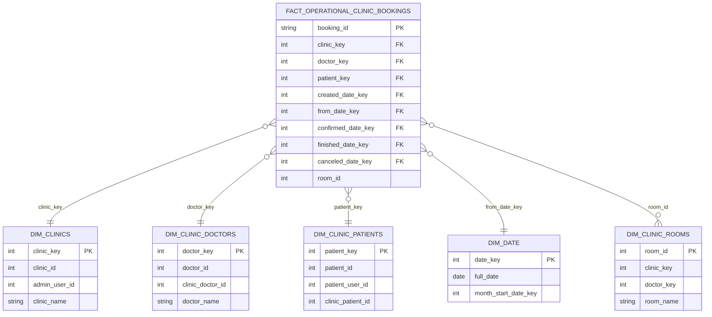
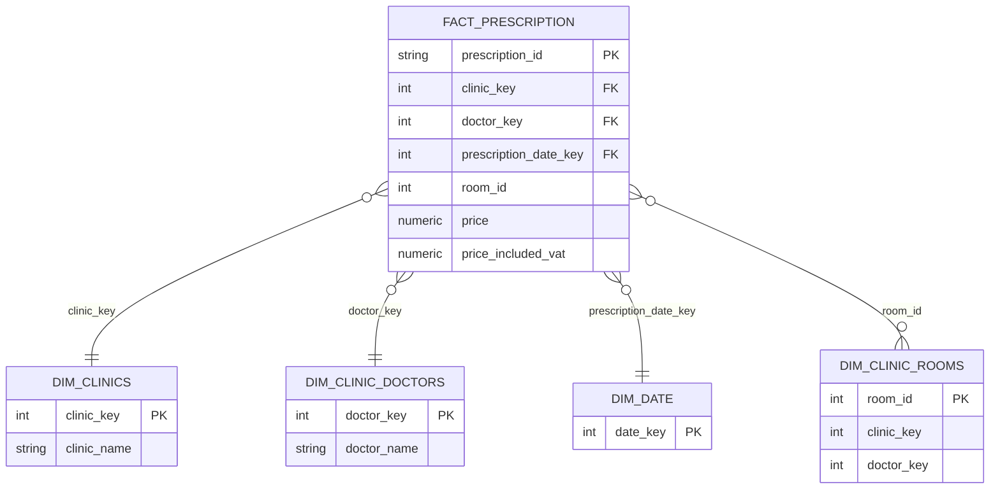
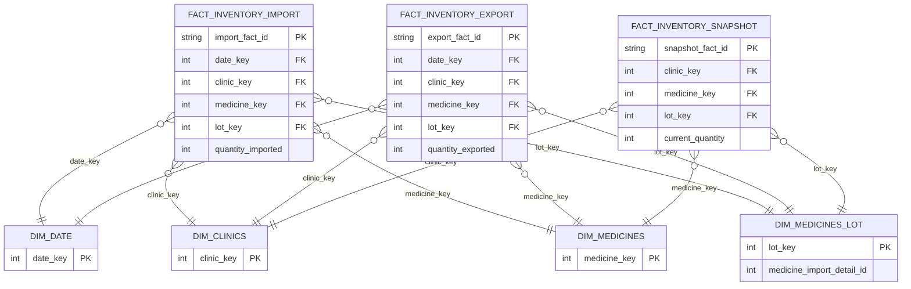
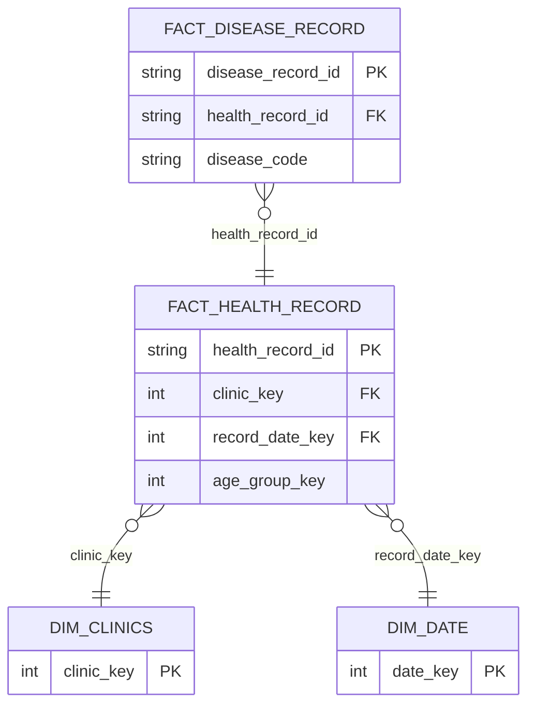
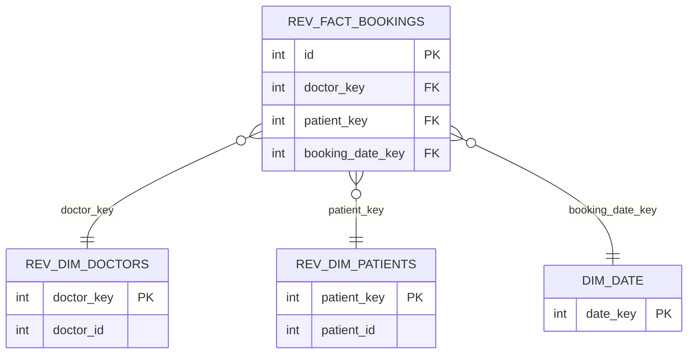
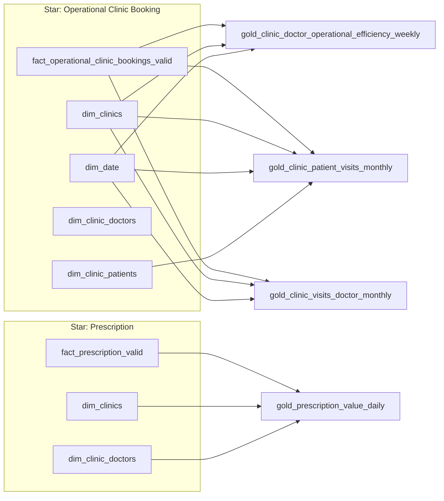

# Star Schema (dbt)

Tài liệu này tóm tắt star schema cho các model chính trong `dbt/models` (đặc biệt các model gold/platinum bạn đang làm).

## 1) Platinum Star Schemas

## 2) Gold Models Mapped To Stars

## 3) Ghi chú nhanh

- `fact_*_valid` là lớp fact đã lọc chất lượng dữ liệu và là nguồn chính cho gold.
- `clinic_key` ở các fact clinic đang join qua `dim_clinics.admin_user_id` (theo chuẩn bạn đang áp dụng).
- Nhánh `rev_*` là nhánh revenue online riêng, dùng `rev_dim_doctors` và `rev_dim_patients`.

